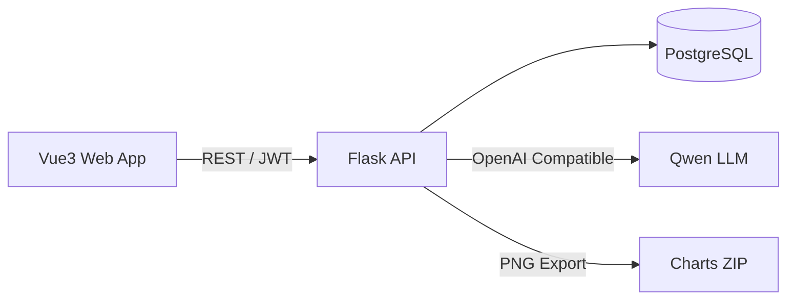

# 萤火集（Learning Analytics System）

一个面向个人学习的「记录 → 分析 → 规划」全栈系统：用结构化学习日志、可视化统计与 AI 辅助复盘，帮助你持续提升学习效率。

## 项目亮点

- **全栈一体**：Vue 3 + Vite + TypeScript（前端） / Flask + SQLAlchemy（后端） / PostgreSQL（数据）
- **结构化学习数据**：按「阶段 → 周 → 日」组织学习记录，支持分页筛选与统计聚合
- **效率分模型 + 增量更新**：基于学习时长与心情对每日效率进行打分，并按日/周增量更新，避免全量重算
- **可视化 + 导出**：趋势与分类统计（ECharts / Chart.js），服务端用 Matplotlib 导出图表 ZIP
- **数据可迁移**：一键 ZIP 备份 / 覆盖导入 / 清空个人数据
- **AI 智能复盘与规划**：对接通义千问（OpenAI Compatible），内置重试、离线兜底模板与历史记录
- **工程化**：JWT 登录 + Refresh、CORS、Flask-Migrate 迁移、Pytest 接口测试

## 功能概览

- **用户系统**：注册 / 登录 / 刷新令牌 / 修改密码
- **学习记录**：任务、日期、时长（分钟）、时间段、心情（1–5）、笔记；支持增删改查与筛选
- **阶段管理**：按学习阶段组织与统计（例如“考研数学一轮”“期末复习周”）
- **分类与标签**：分类 + 子分类（标签），便于做占比与趋势分析
- **仪表盘摘要**：今日学习时长、总记录数、最近记录日期、倒计时与里程碑等摘要信息聚合
- **统计分析**：日/周时长趋势、效率趋势、分类占比、分类趋势；支持导出 ZIP
- **倒计时 / 里程碑**：重要事件管理（考试、DDL 等）与成就记录
- **社区排行（可选加入）**：按周/月等维度展示学习时长等排行（用户自主选择加入/退出）
- **AI 模块**：生成 analysis/plan，并可分页查看历史（按 scope/type 过滤）

## 技术栈

- **前端**：Vue 3、Vite、TypeScript、Pinia、Element Plus、ECharts、Chart.js、Axios
- **后端**：Flask、Flask-JWT-Extended、Flask-SQLAlchemy、Flask-Migrate、Flask-Cors、Matplotlib、python-json-logger
- **数据库**：PostgreSQL（开发默认），测试环境 SQLite（内存）
- **测试**：Pytest
- **AI**：通义千问（DashScope OpenAI Compatible API），支持重试与兜底

## 系统架构（简图）



## 快速开始（本地开发）

前置要求：

- Python 3.9+（推荐 3.12）
- Node.js 18+
- PostgreSQL 12+

### 1) 配置环境变量

复制示例文件并按需修改（数据库 / CORS / AI Key 等）：

```bash
cp .env.example .env
```

关键变量（常用）：

- `DEV_DATABASE_URL`：开发环境 PostgreSQL 连接串（默认见 `backend/config.py`）
- `VITE_API_BASE_URL`：前端请求后端的基地址（通常为 `http://localhost:5000`）
- `QWEN_API_KEY` 或 `DASHSCOPE_API_KEY`：启用 AI 分析/规划（可选）

### 2) 初始化数据库

数据库创建与导入结构：见 `DATABASE_SETUP.md`。

提示：迁移命令依赖后端虚拟环境与 `FLASK_APP` 设置，建议在完成「启动后端」步骤中的依赖安装后执行 `flask db upgrade`。

### 3) 启动后端（Flask）

```bash
cd backend
python -m venv .venv
source .venv/bin/activate
pip install -r requirements.txt

export FLASK_APP=run.py
export FLASK_ENV=development
flask db upgrade
python -m flask run --debug
```

后端默认：`http://127.0.0.1:5000`（健康检查：`/health`）

### 4) 启动前端（Vue）

```bash
cd frontend
npm install
npm run dev
```

前端默认：`http://localhost:5173`

## 测试

```bash
PYTHONPATH=backend pytest backend/tests
```

## 部署

- 生产部署脚本：`scripts/deploy.sh`（依赖 systemd、需要自行准备运行环境与服务单元）

## 项目结构

- `backend/`：Flask API、模型与服务层、迁移与测试
- `frontend/`：Vue 3 前端应用（路由、状态管理、页面与组件）
- `DATABASE_SETUP.md`：PostgreSQL 初始化说明
- `DEVELOPMENT.md`：更完整的本地开发说明
