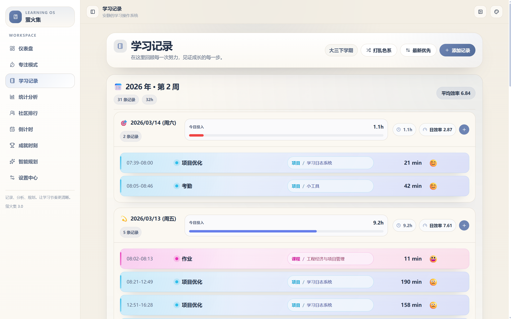
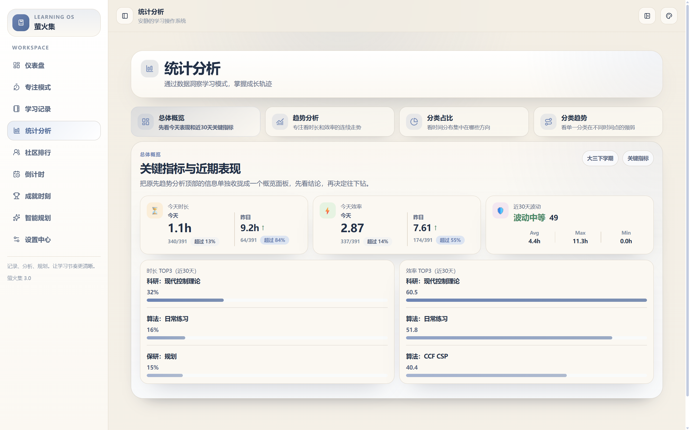
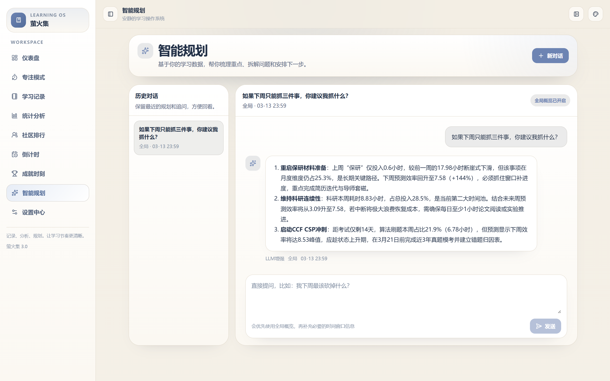
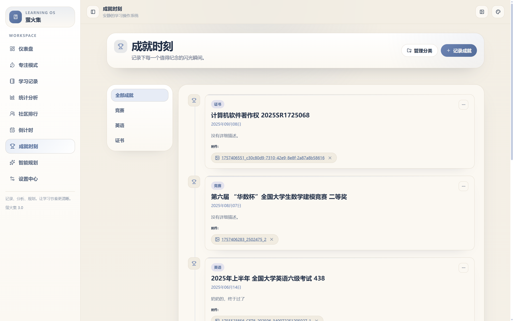

# 萤火集

一个从真实学习生活里长出来的个人项目。

“萤火集”源于开发者作为一名大学生的亲身经历。面对长期而繁重的学业任务，开发者曾用 Excel 记录学习过程，也尝试过把倒计时、备忘录、学习日志拆散在不同工具里，但很快发现：表格会越来越长，记录会越来越机械，过程虽然留下来了，复盘却没有真正发生。

于是，这个项目慢慢出现了。

它最初只是一个学习记录器，后来逐渐长成了一套围绕个人学习展开的系统：记录、汇总、分析、规划、预测，再到 AI 辅助复盘。它不只是一个工具，更像一份持续生长的数字档案，用来承载那些努力、迷茫、调整与收获的时刻，把日复一日的微光真正汇集起来。

## 项目背景

这个项目的起点并不是“做一个完整产品”，而是想解决一个很具体的问题：

- 学习过程可以被记录，却很难被整体看见
- 传统表格适合记账，不适合长期复盘
- 市面上很多工具更偏番茄钟或打卡，而不是面向长期学习过程的沉淀与分析

因此，萤火集想做的不是简单记录学习时长，而是把学习这件事变成一条可以回看、分析、调整和继续推进的轨迹。

## 这个项目想解决什么

学习从来不只有结果。

- 学习过程本身值得被看见
- 努力本身不应该被遗忘
- 迷茫与调整过程同样值得记录
- 长期坚持带来的成就感，应该有一个地方被保存下来

萤火集的核心并不是“帮你打卡”，而是帮助学习者把过程沉淀成一份可以反复回看的个人档案。

## 核心方法

这个项目背后的闭环很简单：

`记录 -> 汇总 -> 分析 -> 规划`

在真实使用场景中，这条链路通常会自然展开成：

`开始学习 -> 专注计时 -> 自动生成记录 -> 查看趋势 -> 做复盘 -> 继续规划下一步`

它强调的不是某一个单点功能，而是几件事必须连起来：

- 只有记录，没有分析，最后容易变成一堆数据
- 只有分析，没有规划，结论很难转化成下一步行动
- 只有规划，没有真实记录，计划又会失去依据

## 它现在是什么

发展到现在，萤火集已经不再只是一个学习记录工具，而是一套围绕个人成长展开的学习分析系统。

它目前具备的核心能力包括：

- 学习记录：围绕任务、分类、子分类、时长、心情、笔记等信息持续沉淀学习日志
- 阶段管理：按照阶段组织学习过程，让记录和统计不再是无边界的长表格
- 统计分析：查看日、周、分类、效率等维度的趋势和概览
- 专注计时：从一次学习开始，到自动生成记录，形成顺手的记录入口
- 倒计时与里程碑：把目标感、时间感和阶段成果一起纳入系统
- 数据留存：支持导入、导出与清空，把学习轨迹真正沉淀下来
- 预测能力：基于已有学习数据，对趋势做进一步延伸和辅助判断
- AI 助理：结合学习数据做分析、复盘、规划与对话式辅助

## 项目特色

萤火集最鲜明的特征，主要体现在以下几个方面：

- 它来自长期真实自用，而不是为了展示功能临时拼起来的 demo
- 它不是单纯记录工具，而是记录、分析、规划彼此相连的一套方法
- 它已经不是一个雏形，而是完成度较高、可以继续长期打磨的产品

进一步展开来看，这个项目还强调：

- 阶段化学习，而不是把所有记录扔进同一个时间轴
- 长期复盘，而不是只看今天有没有完成任务
- 过程留存，把努力本身保存下来
- 数字档案感，让学习过程可以回望
- 较完整的产品体验，以及相对清晰的工程结构

## 界面预览

下面这组图片展示了项目当前已经成型的主要功能页面，对应的页面结构和模块来自前端源码中的核心视图。

### 仪表盘

### 学习记录

### 统计分析

### 智能规划

### 专注模式

### 成就时刻

### 数据管理

## 为什么叫“萤火集”

这个名字想表达的，正是这个项目最在意的东西。

学习里的很多时刻都很微小，甚至当下看起来并不起眼。一次专注、一条记录、一点调整、一个并不耀眼的普通夜晚，它们都像萤火一样，只是很小的一点光。但当这些努力被长期保存、汇总、分析、回看，它们就不再是零散的瞬间，而会慢慢组成一条真正属于自己的轨迹。

“萤火集”想做的，就是把这些点点微光收集起来。

## 它是怎么长出来的

这个项目不是一开始就设计成今天的样子，而是在长期使用和持续迭代中一点点长出来的。

大致可以分成几个阶段：

### 1. 从学习记录器起步

最初只有最核心的学习记录、效率、阶段、图表这些能力。那时重点不是体验，而是先证明这套东西能不能成立。

### 2. 先让它真正活下来

功能有了之后，真正的挑战开始出现在部署、数据库、配置、提交流程和各种 bug 上。这个阶段更像一场生存战，让项目从本地原型变成可运行的系统。

### 3. 开始有产品雏形

随着导出、成就、图表、自动化脚本等能力逐渐加入，它开始不再只是一个能记录学习时长的小工具，而是慢慢具备“产品感”。

### 4. 前后端结构重建

项目后续经历了一次比较明显的现代化重构：前后端结构更清晰，页面、状态管理和模块拆分更完整。这一步很关键，因为它让项目不只是“能用”，而是“还能继续长”。

### 5. 走向完整产品

再往后，数据分析能力、页面系统、AI 规划、历史记录、图表表达、设置体系等开始逐步统一，项目第一次真正有了完整产品的感觉。

### 6. 继续向成熟化和智能化推进

最近的迭代重点已经不再是“把功能做出来”，而是继续打磨预测、AI 对话、主题系统、兼容性、测试、历史数据处理和整体体验。这也是项目最明确的继续演进方向。

最初版本更像是在“记录学习”，而现在这个版本更像是在“理解学习、分析学习、规划学习，并陪着学习过程继续往前走”。

## 适合谁

这个项目更适合那些：

- 愿意长期记录自己学习过程的人
- 有阶段目标，想认真复盘的人
- 不满足于打卡，而想看到趋势和分析的人
- 希望把学习经历沉淀下来的人

它并不是一个适合“完全不想投入记录和复盘”的工具。萤火集的价值，恰恰来自于用户愿意和自己的学习过程认真相处。

## 项目结构

整个仓库目前主要由这几部分组成：

- `frontend/`：前端应用，负责页面、交互、状态管理和可视化体验
- `backend/`：后端 API、业务逻辑、数据模型、AI 与分析服务
- `scripts/`：项目运行和部署相关脚本
- `.env.example`：后端环境变量示例
- `DEVELOPMENT.md`：本地开发、配置、迁移和测试说明

从结构上看，它已经不是一个简单的单页原型，而是一个前后端分离、可持续维护的完整项目。

## 技术概览

为了让“记录、分析、规划”这条链路真正落下来，项目目前主要使用了这些技术：

- 前端：Vue 3、Vite、TypeScript、Pinia、Element Plus、ECharts、Chart.js
- 后端：Flask、SQLAlchemy、Flask-Migrate、JWT、CORS
- 数据：PostgreSQL（开发主用），测试环境支持 SQLite
- AI：通义千问兼容接口接入，支持分析、规划、历史记录和对话
- 工程化：迁移脚本、接口测试、预测测试、环境配置、日志与部署脚本

这些技术并不是这个项目想表达的主角，它们更像是在支撑同一件事：让这套学习复盘方法能够被稳定地长期使用。

## 当前状态

萤火集目前已经具备较高完成度，但仍然是一个会继续成长的长期项目。

它已经具备：

- 完整的个人学习记录链路
- 可持续使用的数据分析与趋势查看能力
- 较成熟的页面体系和交互结构
- 持续增强中的 AI 复盘与规划能力
- 一定程度上的工程完整性与可维护性

它已经足够完整，也仍在继续发展。

## 接下来想继续做什么

接下来最希望继续推进的方向主要有四个：

- 多平台：让它不只停留在单一使用场景里
- 多用户：把社区、排行和多人能力继续做深
- 更强的 AI：让 AI 不只是分析器，而是更长期、更贴近学习过程的助理
- 更成熟的产品表达：让页面体验、通用能力和整体完成度继续提升

## 文档入口

如果想继续往下看实现层面的内容，可以从这里进入：

- [DEVELOPMENT.md](./DEVELOPMENT.md)：开发环境、配置、数据库迁移、测试与运行说明

## 开源协议

本项目采用 [GNU Affero General Public License v3.0 only](./LICENSE) 协议发布。

这意味着基于本项目的修改版本在分发，或以网络服务形式提供给用户时，需要继续遵守 AGPL v3 的源码开放要求。

## 最后

这个项目最想呈现的，并不是“功能很多”或者“技术栈很满”，而是开发者确实在认真思考学习这件事，并且把这种思考长期落实成了一个真实在用、持续生长的系统。

萤火集不是一个急着完成的项目，更像是一件会随着学习过程继续成长的作品。它会继续被使用，也会继续被慢慢打磨下去。
